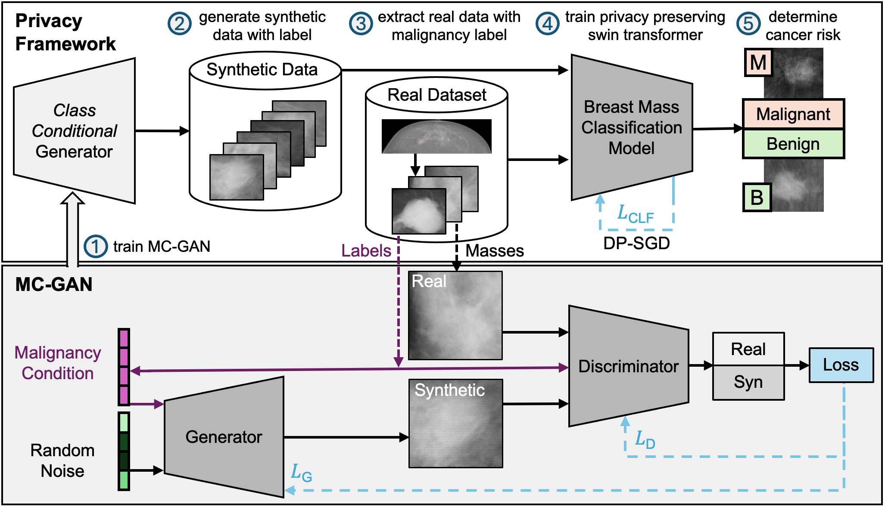
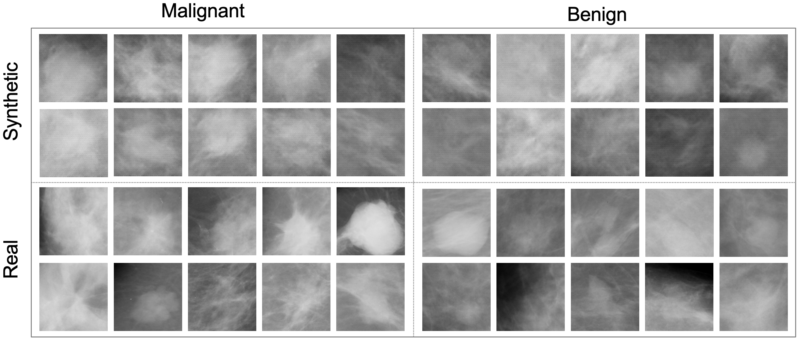

## [Enhancing the Utility of Privacy-Preserving Cancer Classification using Synthetic Data](https://arxiv.org/abs/2407.12669)

In [MICCAI 2024 Deep Breast Workshop](https://deep-breath-miccai.github.io/) on AI and Imaging for Diagnostic and Treatment Challenges in Breast Care.




## Getting Started

### Datasets
If you prefer to directly use our processed dataset consisting of extracted malignant and benign masses, you can find our train, validation, and test dataset in [dataset16062024](dataset16062024).

If you would like to setup your own data processing pipeline, you can find the [CBIS-DDSM Dataset](https://www.nature.com/articles/sdata2017177) used in this study on [The Cancer Imaging Archive (TCIA)](https://www.cancerimagingarchive.net/collection/cbis-ddsm/). 
The [Breast Cancer Digital Repository (BCDR) Dataset](https://www.researchgate.net/profile/Jose-Franco-Valiente/publication/258243150_BCDR_A_BREAST_CANCER_DIGITAL_REPOSITORY/links/59afe98a0f7e9bf3c72930e5/BCDR-A-BREAST-CANCER-DIGITAL-REPOSITORY.pdf), which was used as external test set in this study, is available upon request at the [BCDR Website](https://bcdr.eu/information/about).


### Synthetic Data

You can find the synthetic data used in this study in the folder [extension/synthetic_data/cbis-ddsm](extension/synthetic_data/cbis-ddsm).



If you would prefer to generate your own synthetic data using our MCGAN model, you can do so via the [medigan library](https://github.com/RichardObi/medigan), which loads the model weights used in this study from [Zenodo](https://doi.org/10.5281/zenodo.6647349) and generates malignant and benign masses. 

To generate the masses, simply run:

```command
pip install medigan
```

```python
# import medigan and initialize Generators
from medigan import Generators
generators = Generators()

# generate 1000 samples with model 8 (00008_C-DCGAN_MMG_MASSES). 
# Also, auto-install required model dependencies.
generators.generate(model_id='00008_C-DCGAN_MMG_MASSES', num_samples=1000, install_dependencies=True)
```

## Running Experiments

### Classification Code
- [Script](dbr.sh) to create an environment and run all experiments reported in the [paper](https://arxiv.org/abs/2407.12669). 
- [Configs](gan_compare/configs/swin/) to run the different swin transformer experiments.
- [Config description](gan_compare/configs/swin/dbr_experiment_description.xlsx) excel file explaining the different __dbr__ experiments alongside the respective experimental results.
- [Code](gan_compare/scripts/train_test_classifier.py) to train, validate and test our swin transformer classification model with or without differentially-private stochastic gradient descent.
- [CBIS-DDSM Train-test-splits](setup/example_split.json) and [BCDR external testset](setup/no_train_dbr.json). Final dataset with splits is also available [here](dataset16062024).
- [Paths](gan_compare/paths.py) to the original datasets after downloading them locally.


### Synthesis Code
- [Script](gan.sh) to create an environment and train the Malignancy-Conditioned GAN (MCGAN) e.g. used to then create the synthetic data reported in the [paper](https://arxiv.org/abs/2407.12669).
- [Config](gan_compare/configs/gan/dcgan_config.yaml) to define the setup and hyperparameters for a MCGAN training run.
- [Code](gan_compare/scripts/train_gan.py) to start an MCGAN training run.
- [Code and Checkpoint](https://doi.org/10.5281/zenodo.6647349) that can be used for local setup to run inference of MCGAN (by running the __ init__.py file).
- [FRD metric](https://github.com/RichardObi/frd-score) used in the paper to evaluate the synthetic data based on radiomics imaging biomarker variability between real and synthetic image distributions.


## Summary


## Reference
Please consider citing our work if you found it useful for your research:
```bibtex
@article{osuala2024enhancing,
  title={{Enhancing the Utility of Privacy-Preserving Cancer Classification using Synthetic Data}},
  author={Richard Osuala and Daniel M. Lang and Anneliese Riess and Georgios Kaissis and Zuzanna Szafranowska and Grzegorz Skorupko and Oliver Diaz and Julia A. Schnabel and Karim Lekadir},
  journal={arXiv preprint arXiv:2407.12669},
  url={https://arxiv.org/abs/2407.12669},
  year={2024}
  }
```


## Acknowledgements
This repository borrows and extends the code from the [mammo_gans repository](https://github.com/zuzaanto/mammo_gans_iwbi2022). 
